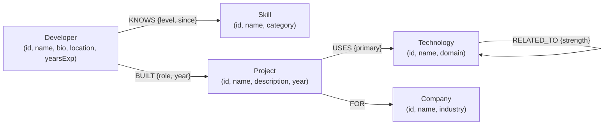

#  DevGraph

DevGraph is a graph-powered developer knowledge and skill exploration web application. It models complex connections between software engineers, their proficiency with skills, the projects they have built, the technologies used in those projects, client companies, and technical stack relationships.

Backed by **CognoDB** (accessed via openCypher over the official `neo4j-driver` Bolt connection), DevGraph enables multi-hop relationship discovery—such as finding developers connected through shared project tech stack ecosystems or identifying technology co-occurrences across projects.

---

## Overview

Traditional developer directories store flat lists of skills or rely on keyword matching, failing to capture how skills and technologies intersect in practice. DevGraph solves this by modeling developer expertise as a connected knowledge graph:

- **Direct Skill Knowledge**: Developers explicitly possess skills at specific proficiency levels (`beginner`, `intermediate`, `expert`).
- **Project Provenance**: Developers build projects that leverage specific technologies for client companies.
- **Graph Traversal & Ecosystem Discovery**: Navigating 3-hop and 5-hop relationships reveals developers who work with complementary tech stacks, shared client companies, and co-occurring technologies across projects.

---

## Why a Graph Database?

### The Relational Overhead

In a relational database (SQL), modeling this domain requires a normalized schema with numerous junction tables:

```
developers ────< developer_skills >──── skills
developers ────< developer_projects >──── projects ────< project_technologies >──── technologies
                                        projects ────< project_companies >──── companies
                                        technologies ────< technology_relations >──── technologies
```

To answer a question such as:
> *"Find developers connected to React through their project histories and discover co-occurring technologies used alongside React in those projects."*

A relational SQL database requires joining 6 to 7 tables:

```sql
SELECT d.id, d.name, p.name AS project_name, t2.name AS co_tech
FROM developers d
JOIN developer_projects dp ON d.id = dp.developer_id
JOIN projects p ON dp.project_id = p.id
JOIN project_technologies pt ON p.id = pt.project_id
JOIN technologies t ON pt.technology_id = t.id
JOIN project_technologies pt2 ON p.id = pt2.project_id
JOIN technologies t2 ON pt2.technology_id = t2.id
WHERE LOWER(t.name) = 'react' AND t2.id <> t.id
GROUP BY d.id, d.name, p.name, t2.name;
```

As traversal depth increases (e.g., 3-hop to 5-hop relationship walks), SQL query complexity explodes with nested subqueries, recursive CTEs, and severe JOIN performance penalties.

### The Graph Approach

In CognoDB using openCypher, graph traversals follow named, directed relationship paths naturally:

```cypher
MATCH (d:Developer)-[:BUILT]->(p:Project)-[:USES]->(t:Technology)
WHERE toLower(t.name) = 'react'
MATCH (p)-[:USES]->(coTech:Technology)
WHERE coTech.id <> t.id
RETURN d.name, p.name, coTech.name
```

Graph database index-free adjacency allows multi-hop traversals to execute in constant or linear time relative to the traversed subgraph, regardless of the overall database size.

---

## Graph Data Model

### Node Labels

| Label | Description | Key Properties |
|---|---|---|
| `Developer` | Software engineer profile | `id`, `name`, `bio`, `location`, `avatarUrl`, `yearsExp` |
| `Skill` | Explicit skill or domain competency | `id`, `name`, `category` (`language` \| `framework` \| `tool` \| `concept`) |
| `Project` | Real-world software project built by developer | `id`, `name`, `description`, `url`, `year` |
| `Technology` | Specific tool or library used in a project | `id`, `name`, `domain` (`frontend` \| `backend` \| `infra` \| `data`) |
| `Company` | Client or organization for whom a project was built | `id`, `name`, `industry` |

### Relationship Types

| Relationship | Source Node → Target Node | Properties | Description |
|---|---|---|---|
| `KNOWS` | `Developer` → `Skill` | `level` (`beginner` \| `intermediate` \| `expert`), `since` | Explicit skill declaration |
| `BUILT` | `Developer` → `Project` | `role` (`solo` \| `lead` \| `contributor`), `year` | Project authorship |
| `USES` | `Project` → `Technology` | `primary` (boolean) | Technologies used in project |
| `FOR` | `Project` → `Company` | — | Target company for project |
| `RELATED_TO` | `Technology` → `Technology` | `strength` (number 0–1) | Conceptual tech stack adjacency |

### Graph Schema Diagram



---

## Architecture

DevGraph enforces strict layer separation. All Cypher query execution and database session management are encapsulated on the server. The client layer consumes clean REST APIs and never constructs Cypher strings or handles database connections directly.

```
┌────────────────────────────────────────────────────────┐
│                   Next.js App Router                   │
│             Client Components (React 19)              │
│      (HomePage, DeveloperProfilePage, ExplorePage)     │
└───────────────────────────┬────────────────────────────┘
                            │ HTTP JSON API Fetch
                            ▼
┌────────────────────────────────────────────────────────┐
│                 Server API Route Handlers              │
│     (/api/developers, /api/skills, /api/technologies)  │
└───────────────────────────┬────────────────────────────┘
                            │ Parameterized Query Calls
                            ▼
┌────────────────────────────────────────────────────────┐
│                  Query Layer & Driver                  │
│       (src/lib/queries/* via neo4j-driver Bolt)        │
└───────────────────────────┬────────────────────────────┘
                            │ openCypher Protocol
                            ▼
┌────────────────────────────────────────────────────────┐
│                    CognoDB Instance                    │
│            (Node Graph Storage & Query Engine)         │
└───────────────────────────┬────────────────────────────┘
```

---

## Main Graph Queries

All database interactions use parameterized openCypher queries executed via the official `neo4j-driver` session layer.

### 1. Developer Profile Projects & Technologies (Single Query Aggregation)

Retrieves a developer's projects along with their linked client companies and technologies using `OPTIONAL MATCH` and `collect()` without N+1 query loops:

```cypher
MATCH (d:Developer {id: $id})-[b:BUILT]->(p:Project)
OPTIONAL MATCH (p)-[:FOR]->(c:Company)
OPTIONAL MATCH (p)-[:USES]->(t:Technology)
WITH p, b, c, collect(DISTINCT {id: t.id, name: t.name, domain: t.domain}) AS technologies
RETURN p.id AS id, p.name AS name, p.description AS description, p.url AS url,
       p.year AS year, b.role AS role,
       c.id AS compId, c.name AS compName, c.industry AS compIndustry,
       technologies
ORDER BY p.year DESC
```

### 2. Skill Peers (3-hop Traversal)

Finds other developers who share skill competencies with a target developer (`Developer → Skill ← Developer`):

```cypher
MATCH (d:Developer {id: $id})-[:KNOWS]->(s:Skill)<-[:KNOWS]-(peer:Developer)
WHERE peer.id <> $id
RETURN peer.id AS id, peer.name AS name, peer.bio AS bio, peer.location AS location,
       peer.avatarUrl AS avatarUrl, peer.yearsExp AS yearsExp, s.name AS skillName
```

### 3. Company Peers (3-hop Client Company Traversal)

Discovers developers connected through shared client companies (`Developer → Project → Company ← Project ← Developer`):

```cypher
MATCH (d:Developer {id: $id})-[:BUILT]->(:Project)-[:FOR]->(c:Company)<-[:FOR]-(:Project)<-[:BUILT]-(peer:Developer)
WHERE peer.id <> $id
RETURN peer.id AS id, peer.name AS name, peer.bio AS bio, peer.location AS location,
       peer.avatarUrl AS avatarUrl, peer.yearsExp AS yearsExp, c.name AS companyName
ORDER BY peer.name ASC
```

### 4. Tech Stack Traversal Peers (5-hop Graph Showcase)

Discovers developers connected through technology graph adjacency (`Developer → Project → Technology → RELATED_TO → Technology ← Project ← Developer`):

```cypher
MATCH (d:Developer {id: $id})-[:BUILT]->(:Project)-[:USES]->(t:Technology)-[:RELATED_TO]-(adj:Technology)<-[:USES]-(:Project)<-[:BUILT]-(peer:Developer)
WHERE peer.id <> $id
RETURN peer.id AS id, peer.name AS name, peer.bio AS bio, peer.location AS location,
       peer.avatarUrl AS avatarUrl, peer.yearsExp AS yearsExp, adj.name AS bridgeTech
```

### 5. Technology Ecosystem & Co-occurrence Traversal

Walks project graphs to discover co-occurring technologies used alongside an anchor technology in developer projects:

```cypher
MATCH (t:Technology {id: $id})<-[:USES]-(p:Project)-[:USES]->(coTech:Technology)
WHERE coTech.id <> $id
RETURN coTech.id AS id, coTech.name AS name, coTech.domain AS domain, p.id AS projId
```

---

## Project Structure

```
├── scripts/
│   ├── init-schema.ts           # Schema constraints & index initialization
│   └── seed.ts                  # CognoDB graph seed dataset loader
├── src/
│   ├── app/
│   │   ├── api/
│   │   │   ├── developers/      # API endpoints for developer profiles & relations
│   │   │   ├── health/          # API endpoint for database status check
│   │   │   ├── skills/          # API endpoints for skill list & ecosystems
│   │   │   └── technologies/    # API endpoints for technology list & ecosystems
│   │   ├── developers/[id]/     # Profile page with multi-hop peer traversal
│   │   ├── explore/             # Multi-hop graph traversal explorer page
│   │   ├── globals.css          # Design system & sharp geometry CSS tokens
│   │   ├── layout.tsx           # Root layout & responsive navigation header
│   │   └── page.tsx             # Homepage & interactive developer search
│   ├── components/
│   │   ├── ui/                  # Reusable UI primitives (Button, Input, Select, Badge, AvatarRow, ThemeToggle, StateComponents)
│   │   ├── DeveloperCard.tsx    # Developer card component
│   │   ├── HeaderNav.tsx        # Responsive header navigation
│   │   ├── ProjectCard.tsx      # Project card component
│   │   ├── SearchBar.tsx        # Filter & query input controls
│   │   ├── SkillBadge.tsx      # Skill level badge component
│   │   └── TechTag.tsx          # Technology tag component
│   ├── hooks/
│   │   └── useFetch.ts          # Generic data fetching hook with state management
│   └── lib/
│       ├── api.ts               # Client-side API client wrapper
│       ├── neo4j.ts             # CognoDB driver singleton & session helper
│       ├── types.ts             # TypeScript interface definitions
│       ├── queries/
│       │   ├── developers.ts    # Parameterized developer Cypher queries
│       │   └── skills.ts        # Parameterized skill & tech Cypher queries
│       └── utils/
│           └── record.ts        # Neo4j record integer parsing helper
├── .env.example                 # Environment variable template
├── package.json                 # Project dependencies & scripts
├── tsconfig.json                # TypeScript configuration
└── README.md                    # Project documentation
```

---

## Setting Up CognoDB Cloud

DevGraph runs against a CognoDB instance accessed via openCypher over the Bolt protocol. Follow these steps to provision a free instance and capture the connection credentials the app needs.

1. **Create an account.** Go to https://console.cognodb.com/signup and sign up. The free tier requires no credit card.
2. **Create a free instance.** From the console, create a free (c0) instance and pick a region. It provisions in under a minute. Each workspace gets one free instance.
3. **Save your connection details.** You will get a connection URI of the form `bolt+s://<instance-id>.databases.cognodb.cloud` and a generated password for the user `cognodb`. The password is shown exactly once — copy or download it immediately and store it where your code reads its secrets.
4. **Connect with an official Neo4j driver.** This project already uses the official `neo4j-driver` Bolt connector. Point it at your `bolt+s://` URI with username `cognodb` and your saved password (see [Environment Setup](#environment-setup)), then run the schema/seed scripts and queries. No other code changes are needed.

### Free Tier Limits

The free (c0) instance is small: burstable 0.5 vCPU, 256 MB RAM, 1 GB disk, up to 200 connections. Size your dataset accordingly — a few thousand to a few hundred thousand nodes and relationships is enough to demonstrate your use case clearly.

---

## Getting Started

### Prerequisites

- **Node.js**: v18.0.0 or higher
- **npm**: v9.0.0 or higher
- **CognoDB Instance**: Accessible via openCypher over Bolt protocol (see [Setting Up CognoDB Cloud](#setting-up-cognodb-cloud))

### Environment Setup

1. Copy the example environment file:
   ```bash
   cp .env.example .env.local
   ```

2. Configure your database credentials in `.env.local`:
   ```ini
   COGNODB_URI=bolt://localhost:7687
   COGNODB_USERNAME=neo4j
   COGNODB_PASSWORD=your_secure_password
   ```

### Installation & Initialization

1. Install project dependencies:
   ```bash
   npm install
   ```

2. Initialize database schema constraints:
   ```bash
   npm run db:init
   ```

3. Seed the CognoDB graph database with realistic sample data:
   ```bash
   npm run seed
   ```

4. Start the development server:
   ```bash
   npm run dev
   ```

5. Open [http://localhost:3000](http://localhost:3000) in your browser.

---

## Environment Variables

| Variable | Description | Required | Example |
|---|---|---|---|
| `COGNODB_URI` | Bolt connection URI for CognoDB | Yes | `bolt://localhost:7687` |
| `COGNODB_USERNAME` | Authentication username | Yes | `neo4j` |
| `COGNODB_PASSWORD` | Authentication password | Yes | `password123` |

*Note: Environment variables are server-side only and are never exposed to the client bundle.*

---

## Screenshots

### Developer Search & Explorer


### Developer Profile & Multi-Hop Peers


### Graph Traversal Explorer


---

## Deployment

DevGraph is built on Next.js App Router and can be deployed to Vercel, Render, AWS, or any Node.js hosting platform.

### Vercel Deployment

1. Push your repository to GitHub / GitLab.
2. Import the project in Vercel.
3. Configure the environment variables (`COGNODB_URI`, `COGNODB_USERNAME`, `COGNODB_PASSWORD`) in the Vercel project settings.
4. Deploy. The build step executes `next build` automatically.

### Production Build Verification

To verify the production build locally:

```bash
npm run build
npm run start
```

---

## Technical Decisions

1. **No Client-Side Cypher Execution**: All Cypher queries are written server-side in parameterized functions (`src/lib/queries/*`). The frontend interacts strictly via typed API endpoints.
2. **Official Neo4j Driver Singleton**: Database connections reuse a single driver instance across server invocations (`src/lib/neo4j.ts`), managing sessions securely with automatic cleanup (`session.close()`).
3. **Single-Query Aggregations**: Eliminates N+1 database queries by using `OPTIONAL MATCH` and openCypher `collect()` to fetch complex node trees in single round-trips.
4. **No Heavy Graph Visualization Libraries**: Rather than embedding complex canvas/force-directed libraries, graph relationships are rendered using responsive, semantic UI lists, column hops, and relationship badges.
5. **Sharp Geometric Design System**: Uses a technical visual aesthetic with CSS custom variables for Light and Dark modes (`globals.css`), eliminating arbitrary rounded corners and unnecessary decorative bloat.
6. **Strict Atomic Component Reusability**: UI elements (`Button`, `Input`, `Select`, `Badge`, `AvatarRow`, `ThemeToggle`) are standardized and reused across all pages to ensure UI consistency.

---

## Limitations

- **Read-Heavy Focus**: The application is optimized for searching, traversing, and exploring developer knowledge graphs. Write operations are handled via seed and schema scripts.
- **Dataset Size**: The included seed dataset contains 12 developers, 16 skills, 10 projects, 12 technologies, and 6 companies. Graph queries are designed to scale to larger datasets, but demo dataset size is intentionally compact.
- **Authentication**: User accounts and authentication tokens are omitted in alignment with MVP scope.

---

## Future Improvements

- **Interactive Graph Canvas**: Optional node-link canvas rendering using lightweight SVG/Canvas for visual subgraph exploration.
- **Graph Write Interfaces**: UI forms allowing non-technical users to create developers, add skills, and attach new projects directly to the CognoDB graph.
- **Advanced Graph Analytics**: Integration of openCypher centrality and community detection algorithms (e.g., PageRank, Louvain modularity) to highlight top technical influencers.
